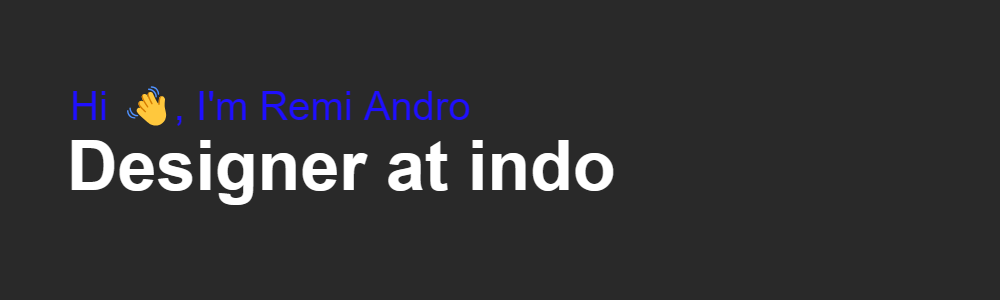

 
 

- 🔭 I’m currently **Freelance**

- 🌱 I’m currently learning **Codeigniter**

- 💬 Ask me about **Design Photo**

- 📫 How to reach me **remi87943@gmail.com**

 
 

## Connect with me  

 
 

## Tools

 

 
 
